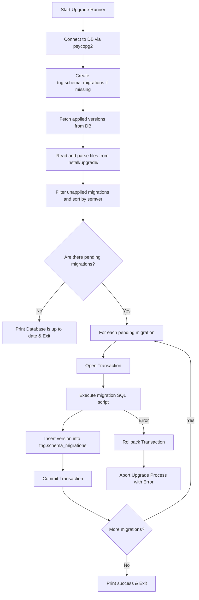

# Requirements

### Overview & Goals
The objective is to establish a robust, automated database migration strategy for Histarchexplorer (tng) to manage SQL schema and data updates incrementally as the application evolves. Currently, SQL updates are recorded in files named after release versions (such as `install/upgrade/0.4.0.sql`), but applying them relies on manual execution or unmanaged custom scripts. 

To solve this, we propose a lightweight, transaction-safe database migration runner integrated into the project's Python and PostGIS stack. Since the project utilizes raw SQL queries via `psycopg2` and does not use an ORM like SQLAlchemy, a lightweight Python-based runner is the cleanest, zero-dependency solution that integrates natively into the existing deployment workflows.

### Scope
- **In Scope**:
  - Automatically tracking which upgrades have been applied using a database metadata table.
  - Sorting and executing pending SQL scripts in semantic order.
  - Providing transaction safety where individual failed migrations are automatically rolled back, stopping subsequent executions.
  - Integrating tracking into initial installation scripts so fresh installations start as fully upgraded.
- **Out of Scope**:
  - Migrating to a heavy database framework or ORM like SQLAlchemy or Alembic.
  - Tracking/reverting down migrations automatically (standard SQL files are up-only).

# Technical Design

### Architectural Overview
To implement a robust SQL database upgrade system, we introduce a central tracking table, `tng.schema_migrations`, inside the PostgreSQL database. An upgrade runner script `install/upgrade.py` discovers SQL scripts under `install/upgrade/`, filters out already-applied scripts, sorts them using semantic versioning, and executes each script inside an isolated transaction.



### Database Tracking Table
A tracking table named `tng.schema_migrations` will be initialized in the `tng` schema to log the history of applied migrations:

```sql
CREATE TABLE IF NOT EXISTS tng.schema_migrations (
    version VARCHAR(50) PRIMARY KEY,
    applied_at TIMESTAMP WITH TIME ZONE DEFAULT NOW()
);
```

### Incremental Upgrade Runner (`install/upgrade.py`)
This PEP 8-compliant script parses version files (e.g., `0.4.0.sql`) using regular expressions and standard tuple sorting, running each unapplied script safely in its own transaction block.

```python
import re
from pathlib import Path
from typing import Any

import psycopg2

from histarchexplorer import app


def parse_version(filename: str) -> tuple[int, ...]:
    """Parse version tuple from SQL file name.

    e.g. '0.4.0.sql' -> (0, 4, 0)
    """
    match = re.search(r'(\d+)\.(\d+)\.(\d+)', filename)
    if match:
        return tuple(map(int, match.groups()))
    return (0, 0, 0)


def create_migrations_table(cursor: Any) -> None:
    """Create the schema_migrations table if it does not exist."""
    cursor.execute("""
        CREATE TABLE IF NOT EXISTS tng.schema_migrations (
            version VARCHAR(50) PRIMARY KEY,
            applied_at TIMESTAMP WITH TIME ZONE DEFAULT NOW()
        );
    """)


def get_applied_versions(cursor: Any) -> set[str]:
    """Fetch the set of already applied migration versions."""
    cursor.execute("SELECT version FROM tng.schema_migrations;")
    return {row[0] for row in cursor.fetchall()}


def apply_migration(
    connection_: Any,
    cursor: Any,
    filepath: Path,
    version: str
) -> None:
    """Run SQL from filepath and record version in schema_migrations."""
    with filepath.open('r') as f:
        sql = f.read()

    cursor.execute(sql)
    cursor.execute(
        "INSERT INTO tng.schema_migrations (version) VALUES (%s);",
        (version,))
    print(f"Applied migration: {filepath.name}")


def main() -> None:
    """Discover, sort, and apply unapplied SQL upgrades."""
    conn = psycopg2.connect(
        dbname=app.config['DATABASE_NAME'],
        user=app.config['DATABASE_USER'],
        password=app.config['DATABASE_PASS'],
        host=app.config['DATABASE_HOST'],
        port=app.config['DATABASE_PORT'])

    base_dir = Path(__file__).resolve().parent / 'upgrade'
    sql_files = list(base_dir.glob('[0-9]*.[0-9]*.[0-9]*.sql'))

    try:
        with conn:
            with conn.cursor() as cur:
                create_migrations_table(cur)
                applied = get_applied_versions(cur)

                pending = []
                for filepath in sql_files:
                    match = re.search(r'(\d+\.\d+\.\d+)', filepath.name)
                    if match:
                        version_str = match.group(1)
                        if version_str not in applied:
                            version_tuple = parse_version(filepath.name)
                            pending.append((
                                version_tuple,
                                version_str,
                                filepath))

                pending.sort(key=lambda x: x[0])

                if not pending:
                    print("Database is up to date. No pending migrations.")
                    return

                for _, version_str, filepath in pending:
                    apply_migration(conn, cur, filepath, version_str)

                print("Database upgrade completed successfully.")
    except Exception as e:
        print(f"Upgrade failed: {e}")
        raise
    finally:
        conn.close()
        print("Database connection closed.")


if __name__ == '__main__':
    main()
```

### Seeding Clean Installations (`install/install_script.py`)
To prevent fresh installations from attempting to re-apply historical SQL files (which are already baked into the structure file `1_structure.sql`), `install_script.py` is updated to record existing migrations as applied automatically:

```python
def seed_migrations(cursor: Any, upgrade_dir: Path) -> None:
    """Create the migration table and mark existing migrations as applied."""
    cursor.execute("""
        CREATE TABLE IF NOT EXISTS tng.schema_migrations (
            version VARCHAR(50) PRIMARY KEY,
            applied_at TIMESTAMP WITH TIME ZONE DEFAULT NOW()
        );
    """)

    sql_files = list(upgrade_dir.glob('[0-9]*.[0-9]*.[0-9]*.sql'))
    for filepath in sql_files:
        match = re.search(r'(\d+\.\d+\.\d+)', filepath.name)
        if match:
            version_str = match.group(1)
            cursor.execute("""
                INSERT INTO tng.schema_migrations (version)
                VALUES (%s)
                ON CONFLICT (version) DO NOTHING;
            """, (version_str,))
            print(f"Seeded migration version {version_str} as applied.")
```

Inside the `main()` function of `install_script.py`, this is executed directly after the base tables are initialized:
```python
    try:
        with conn:
            with conn.cursor() as cur:
                for sql_path in sql_paths:
                    run_sql_file(cur, sql_path)
                seed_migrations(cur, base_dir / 'upgrade')
```

# Testing

### Verification Strategy
As part of the implementation, tests should be written to verify migration execution and transaction behavior.

### Testing Scenarios
1. **Dynamic Initialization Scenario**:
   - Dropping the `tng.schema_migrations` table completely and running `install/upgrade.py`.
   - Verifying the table is automatically recreated and populated.
2. **Sequential Version Application Scenario**:
   - Simulating two fake upgrade files: `99.0.0.sql` and `98.0.0.sql`.
   - Ensuring `98.0.0.sql` is executed first regardless of the order they are detected on disk.
3. **Transaction Rollback Scenario**:
   - Introducing an invalid statement inside a migration file.
   - Verifying that when executed, the whole script rolls back and the version is not added to `tng.schema_migrations`.
4. **Idempotency Scenario**:
   - Running `install/upgrade.py` twice consecutively and verifying the second execution runs no queries and prints "Database is up to date".

# Delivery Steps

### ✓ Step 1: create-upgrade-runner-script
Create the database migration tracking table and the unapplied migration runner script `install/upgrade.py`.

- Add a new PEP 8-compliant script `install/upgrade.py` with maximum 79-character line lengths.
- Implement automatic schema migration discovery matching the version pattern `[0-9]*.[0-9]*.[0-9]*.sql` from the `install/upgrade/` directory.
- Parse file names to extract version strings and sort them semantically using parsed tuple comparison.
- Implement automatic tracking table creation (`tng.schema_migrations`) inside the schema to track executed versions.
- Execute unapplied upgrade files sequentially, running each within its own database transaction block to guarantee safe rollbacks.
- Record the successful application of each upgrade version in the tracking table upon completion.

### ✓ Step 2: integrate-with-install-script
Seed the database tracking table for clean installations.

- Update `install/install_script.py` to import `re`.
- Implement `seed_migrations()` within `install/install_script.py` to create the `tng.schema_migrations` table and register all existing upgrade files as already applied.
- Call `seed_migrations()` after the execution of the initial database structure and data model SQL dumps.
- This ensures that a fresh setup starts with all current migrations recorded as applied, preventing double-execution when `install/upgrade.py` runs later.

### ✓ Step 3: test-and-document-migrations
Integrate and verify database upgrades in testing environments.

- Update `tests/base.py`'s `reset_test_database()` to execute the migration-seeding functionality on the test database.
- Document the database upgrade procedure in the developer guidelines to explain how developers should write new releases' SQL files (e.g. `install/upgrade/0.5.0.sql`) and run the upgrade utility.